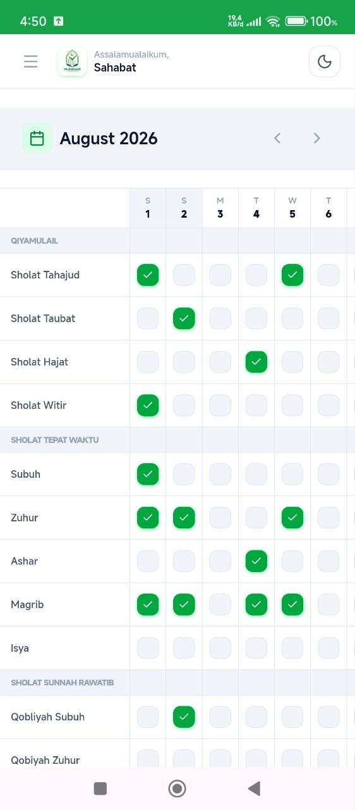
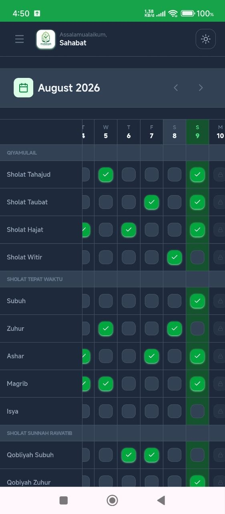
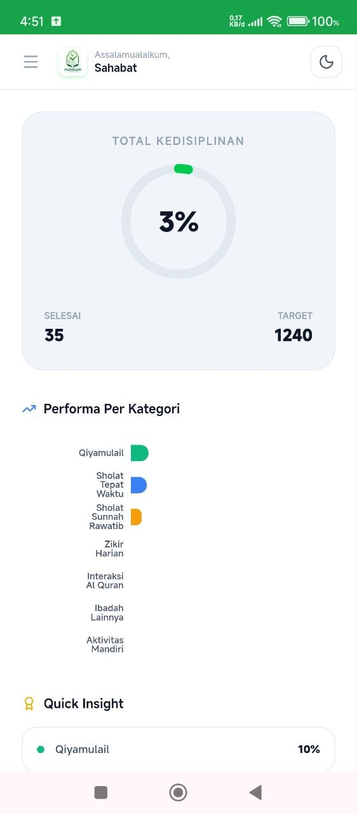

# 🌙 Mutabaah Tracker

> **A private, offline-first PWA for Muslims to track daily worship habits, build consistency, and reflect on their monthly progress — with no account or cloud storage required.**

[](https://nextjs.org/)
[](https://www.typescriptlang.org/)
[](https://web.dev/progressive-web-apps/)
[](../LICENSE)

---

## 📸 Preview

<!-- Replace with your actual screenshot or demo GIF 
 -->
| Light Mode | Dark Mode | Statistics |
|---|---|---|
|  |  |  |

> A simple and private way to keep track of your daily worship habits directly from your device.

---

## ✨ Features

- **📅 Monthly Mutabaah Grid** — Track daily worship activities in an easy-to-scan monthly grid.
- **👆 One-Tap Tracking** — Mark activities as completed with a single tap.
- **🔒 Past & Future Day Rules** — Past days remain editable while future days are automatically locked.
- **📊 Progress Statistics** — View overall and category-level completion progress through interactive charts.
- **🌙 Dark Mode** — Switch between light and dark themes with your preference saved locally.
- **👤 Custom Greeting** — Personalize the name displayed next to *Assalamualaikum*.
- **🗑️ Reset Data** — One-tap button to clear all stored data with a confirmation prompt.
- **📱 Installable PWA** — Install the app on supported devices and use it like a native application.
- **📴 Offline-First** — App opens offline with cached data; updates only apply when connected.
- **🔐 Private by Design** — No login, account, or cloud database. Your data stays on your device.

---

## 🛠️ Tech Stack

| Layer | Technology |
|---|---|
| **Framework** | [Next.js 16](https://nextjs.org/) — App Router |
| **Language** | TypeScript |
| **Styling** | Tailwind CSS v4 + CSS Variables |
| **Local Database** | [Dexie.js](https://dexie.org/) — IndexedDB |
| **PWA** | [Serwist](https://serwist.pages.dev/) |
| **Animation** | [Framer Motion](https://www.framer.com/motion/) |
| **Charts** | [Recharts](https://recharts.org/) |
| **Icons** | [Lucide React](https://lucide.dev/) |

### Prerequisites

- **Node.js 18+**
- **npm**
- A modern web browser

No database server, API key, or external service is required.

---

## 🚀 Getting Started

Get the project running locally in a few steps.

### 1. Clone the repository

```bash
git clone https://github.com/fauzihiz/mutabaah-pwa.git
```

### 2. Navigate to the project

```bash
cd mutabaah-pwa/mutabaah-pwa
```

### 3. Install dependencies

```bash
npm install
```

### 4. Start the development server

```bash
npm run dev
```

Open **http://localhost:3000** in your browser.

---

## ⚙️ Environment Variables

No environment variables are required.

The application stores its data locally in the browser using **IndexedDB**, so there is currently no backend, database server, authentication service, or API configuration.

---

## 📖 Usage

### Track a daily activity

1. Open the dashboard.
2. Select the desired month.
3. Find the activity you want to track.
4. Tap the corresponding day.
5. The completion status is saved automatically.

### View your progress

Open the **Statistics** view to see:

- Overall completion progress
- Category-level statistics
- Visual progress charts

### Personalize your greeting

Tap the name displayed next to **"Assalamualaikum"** and enter your preferred name.

### Use Dark Mode

Toggle the theme from the dashboard header. Your preference is stored locally.

### Install as an App

On a supported browser, use the browser's **Install App** or **Add to Home Screen** option to install Mutabaah Tracker as a PWA.

---

## 🧪 Running Tests

A dedicated automated test suite is **not currently configured** for this project.

For now, verify changes by running the production build:

```bash
npm run build
```

Then start the production server:

```bash
npm start
```

---

## 📁 Project Structure

```text
mutabaah-pwa/
├── app/
│   ├── page.tsx
│   │   └── Dashboard (main screen)
│   ├── layout.tsx
│   │   └── Root layout + theme provider
│   └── ~offline/
│       └── page.tsx
│           └── Offline fallback page
│
├── components/
│   ├── dashboard/
│   │   ├── DashboardHeader.tsx
│   │   │   └── Header + logo + dark mode toggle
│   │   ├── MutabaahGrid.tsx
│   │   │   └── Monthly activity grid
│   │   ├── MonthPicker.tsx
│   │   │   └── Month navigation
│   │   ├── StatsView.tsx
│   │   │   └── Statistics charts
│   │   ├── NavigationDrawer.tsx
│   │   │   └── Side menu
│   │   ├── ChangelogModal.tsx
│   │   │   └── Version history
│   │   └── DashboardFooter.tsx
│   │       └── Footer
│   │
│   └── providers/
│       └── ThemeProvider.tsx
│           └── Dark/light mode context
│
├── hooks/
│   ├── useMutabaah.ts
│   │   └── Activity logs
│   ├── useMonthlyStats.ts
│   │   └── Statistics computation
│   └── useActivitySettings.ts
│       └── Custom activity names
│
├── lib/
│   ├── db.ts
│   │   └── Dexie / IndexedDB schema
│   └── constants/
│       └── activities.ts
│           └── Activity list & categories
│
└── public/
    ├── manifest.json
    ├── favicon.ico
    └── logo.png
```

---

## 🔐 Privacy & Data

Mutabaah Tracker is designed to keep personal worship data private.

- **No account required**
- **No login**
- **No cloud database**
- **No cloud synchronization**
- **No external backend required**
- Data is stored locally using **IndexedDB**

> ⚠️ **Important:** Clearing browser data or uninstalling the application can permanently delete your locally stored records.

Your data currently remains on the browser/device where it was created.

---

## 🗺️ Roadmap

### ✅ Completed

- [x] Monthly worship tracking grid
- [x] One-tap activity completion
- [x] Past-day editing
- [x] Future-day locking
- [x] Local IndexedDB storage
- [x] Dark mode
- [x] Customizable greeting name
- [x] Monthly statistics
- [x] Category-level statistics
- [x] Interactive charts
- [x] PWA support
- [x] Offline functionality
- [x] Navigation drawer
- [x] Changelog modal
- [x] Reset all local data
- [x] Custom activity name fallback to default

### 🚧 Planned

- [ ] Export and import local data
- [ ] Backup and restore functionality
- [ ] More customization options for activities
- [x] Improved PWA update handling
- [ ] Additional progress insights
- [ ] Enhanced accessibility
- [ ] Automated testing

### 🔮 Future Ideas

- [ ] Optional cloud synchronization
- [ ] Multi-device data sync
- [ ] User-defined activity categories
- [ ] More detailed historical analytics
- [ ] Streak and consistency insights

---

## 🤝 Contributing

Contributions are welcome!

If you want to make a significant change, please open an issue first to discuss the proposed improvement.

For smaller improvements:

1. Fork the repository.
2. Create a feature branch.

```bash
git checkout -b feature/your-feature
```

3. Make your changes.
4. Verify the production build.

```bash
npm run build
```

5. Commit your changes.

```bash
git commit -m "feat: add your feature"
```

6. Push your branch.

```bash
git push origin feature/your-feature
```

7. Open a Pull Request.

---

## 👨‍💻 Author

**Fauzi Hizbullah**

[Portfolio](https://fauzihiz.github.io) · [GitHub](https://github.com/fauzihiz)

---

## 📄 License

This project is licensed under the **MIT License**.

See [LICENSE](../LICENSE) for the full license text.